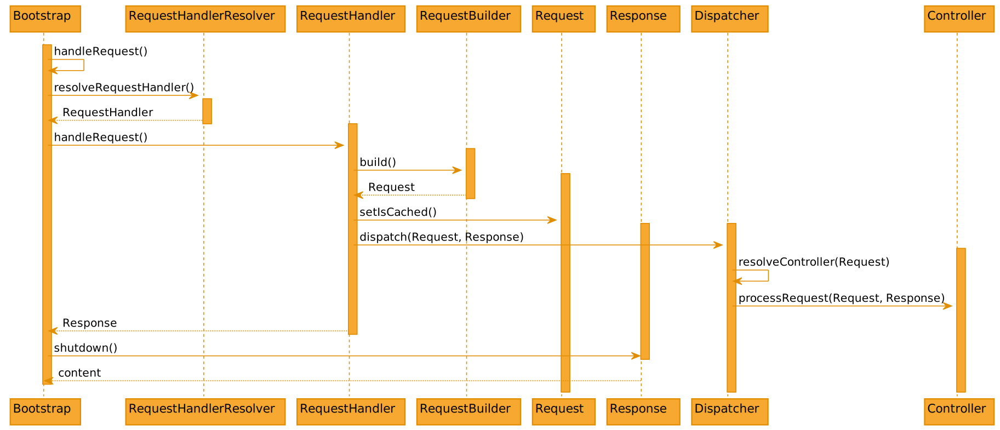

.. include:: /Includes.rst.txt
.. highlight:: php
.. _dispatching:

===========
Dispatching
===========

The dispatcher's job is to find a class that can handle the current page
request. Once found, the dispatcher executes the method *handleRequest* in the
matching class and receives the result. This result is then passed out as
website content.

Here's the dispatcher path, step by step:

   Figure 1-1: Extbase dispatching process

.. _requesthandlerresolver:

RequestHandlerResolver
======================

Extbase innately contains a couple of classes for various requests and makes
them available via :file:`Configuration/Extbase/RequestHandlers.php`::

   return [
       \TYPO3\CMS\Extbase\Mvc\Web\FrontendRequestHandler::class,
       \TYPO3\CMS\Extbase\Mvc\Web\BackendRequestHandler::class,
   ];

This is how Extbase provides a :php:`RequestHandler` for requests in frontend or
backend context.

Thanks to this configuration, one can register a custom :php:`RequestHandler`.
For example, a handler for AJAX requests can be registered here.

The class-specific method :php:`canHandleRequest()` decides whether the request
can be handled by its :php:`RequestHandler`. For a :php:`BackendRequestHandler`,
the check looks like this::

   canHandleRequest()
   {
       return $this->environmentService->isEnvironmentInBackendMode()
           && !Environment::isCli();
   }

Because multiple RequestHandlers can be responsible for a request, a
prioritization system is necessary. This is because only one RequestHandler can
take responsibility. Default priority is set to `100`. If another RequestHandler
needs to take priority, the method :php:`getPriority()` should return a higher
value.

Once the definitive RequestHandler has been identified, its method
:php:`handleRequest()` is executed. This method creates an object containing all
of the necessary data for the page request, using the :php:`RequestBuilder`. It
searches through the plugin configuration in :file:`ext_localconf.php` in order
to find out which controller and action should be used as standard. The
RequestBuilder also checks the Uri, to check whether an alternative controller
or an alternative action should be loaded instead of the entries from
:file:`ext_localconf.php`.

.. note::

   Extbase does not use PSR-7 for requests, but
   custom implementations.

.. _the-dispatcher:

The dispatcher
==============

The dispatcher fetches the controller name from the request object and creates
the controller.

The object :php:`Request` is passed to the controller,
and the role of the dispatcher is complete. The
Controller now returns the response, which is handed back all the way to the
:php:`Bootstrap` which calls :php:`shutdown()`. It is now up to the response to
handle further stuff, e.g., send headers and return rendered content.

That is the point when TYPO3 receives the content and integrates it into the
rendering. The response itself will already send headers, and no TYPO3 API will be
used at this place.

.. _the-controller:

The controller
==============

The controller generates a :php:`\Psr\Http\Message\ResponseInterface` object. The
controller can also set further response headers and access arguments from the
:php:`Request`.

.. _accessing-the-request:

Accessing the request
---------------------

Within the controller, :php:`$this->request` allows to access the incoming
request. This way, it is possible to access all arguments provided to the
request directly. Still, it is better to use argument mapping instead.

In case of a forward, the request also enables access to the original request.
Further information like the controller name and plugin name can be retrieved
from the request.

Arguments can be accessed through::

   $this->request->getArgument('argumentName');

In order to make arguments available within the request or for mapping, they
need to conform to Extbase's naming standard in order to be mapped to the
extension. The default is to prefix arguments with the plugin signature. This can be
adjusted via TypoScript option :ts:`view.pluginNamespace`, see
:ref:`typoscript_configuration-view`.

.. _using-the-response:

Creating a response
-------------------

Extending the :php:`ActionController` usually makes it unnecessary to
manually create a response, as the :php:`callActionMethod()` already takes
care of it. However, to gain better control over the returned response, a
PSR-7 response can be created and returned, for example, if headers should
be set explicitly.

Responses need to implement :php:`\Psr\Http\Message\ResponseInterface`.
To create a response, it is recommended to use the :ref:`PSR-17 response factory <t3coreapi:request-handling-psr-17>`::

   use Psr\Http\Message\ResponseFactoryInterface;
   use Psr\Http\Message\ResponseInterface;

   // ...

   public function __construct(ResponseFactoryInterface $responseFactory)
   {
      $this->responseFactory = $responseFactory;
   }

   public function yourAction(): ResponseInterface
   {
       $response = $this->responseFactory
           ->createResponse()
           ->withHeader('Content-Type', 'application/json; charset=utf-8');
       $response->getBody()->write(json_encode($data));
       return $response;
   }

.. _returning-content:

Returning content
-----------------

Each action within the controller can optionally return content. If nothing is
returned, the default implementation will render :php:`$this->view` and return
the rendering result.

Content can be returned as string or object with :php:`__toString()`
implementation.

.. _forwarding-a-request:

Forwarding a request
--------------------

Within an action the current request can be forwarded to another action by
returning a `ForwardResponse`::

   use Psr\Http\Message\ResponseInterface;
   use TYPO3\CMS\Extbase\Mvc\Controller\ActionController;
   use TYPO3\CMS\Extbase\Http\ForwardResponse;

   class FooController extends ActionController
   {
      public function listAction(): ResponseInterface
      {
           // do something

           return (new ForwardResponse('show'))
               ->withControllerName('ForeignController')
               ->withExtensionName('ForeignExtension')
               ->withArguments(['foo' => 'bar'])
          ;
      }
   }

.. _redirecting-a-request:

Redirecting a request
---------------------

Within an action the current request can be redirected to another action or uri::

   $this->redirect('newAction', 'ForeignController', 'ForeignExtension');
   $this->redirectToUri('https://example.com');

In the first example, Extbase will build the URL and call :php:`redirectToUri()`.

Extbase will adjust the response to contain the redirect and stop execution by
throwing an exception.
