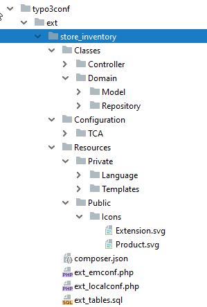

.. include:: /Includes.rst.txt
.. index::
   Extensions; Folder structure
   Extensions; Configuration files

===============================================
Create folder structure and configuration files
===============================================

Before the first lines of code can be written, it is necessary to create the basic infrastructure of the extension.
To allow TYPO3 to load the extension, some default configuration files must be created.
Let's start by creating a folder ``store_inventory`` in the folder :file:`typo3conf/ext/`
- the folder name `store_inventory` corresponds to the unique identifier of our extension
(also known as "extension key").

.. tip::

   The extension key may only contain small letters and underscores (lower_underscore).

.. hint::

    Extensions can be stored at different places in TYPO3.
    Locally installed extensions are the rule.
    These are in the folder :file:`typo3conf/ext/`.
    Global extensions are in the folder :file:`typo3/ext/`.
    System extensions are in the folder :file:`typo3/sysext/`.
    Extbase or Fluid are examples of system extensions.

The folder structure
====================

Inside of the folder `store_inventory` the sub folders :file:`Classes` and :file:`Resources` must be created.
The folder :file:`Classes` must contain all of the PHP class files.
In the folder :file:`Resources` two directories named :file:`Private` and :file:`Public` must be created.
The folder :file:`Resources/Private/` will contain subfolders like
:file:`Templates`, :file:`Layouts`, :file:`Partials` and :file:`Language`.
These files are not accessible via the web browser, they are mostly used via PHP.
The folder :file:`Resources/Public/` contains subfolders like :file:`Icons`,
:file:`Css`, :file:`Js`. These files can be accessed through the web browser.

Within the folder :file:`Classes` the subfolders :file:`Controller` and :file:`Domain` must be created.
In this example, the folder :file:`Controller` contains only one class
that will control the entire process of listing creation later.
The folder *Domain* contains the two folders :file:`Model` and :file:`Repository`.
Resulting from all this, the folder structure within the extension folder
:file:`store_inventory` should look as in image 4-1.

   Figure 4-1: The default directory structure with the important files for the extension manager

.. index:: Files; ext_emconf.php

Configuration file :file:`ext_emconf.php`
=========================================

A single configuration file named :file:`ext_emconf.php` is required by TYPO3
to allow loading the extension. The file is located in the extension's
top-level folder (:file:`store_inventory/`). You can copy and adapt this file
from an existing extension.

The file :file:`ext_emconf.php` contains the meta-information for the
extension like title, description, status, name of the author, and more.
It is not special in any way and does not differ from the one of any other
extension. Find a complete reference in chapter :ref:`t3coreapi:extension-declaration`
of the *Core Api Reference* manual.

.. code-block:: php

   <?php

   $EM_CONF[$_EXTKEY] = [
       'title' => 'Store Inventory',
       'description' => 'This TYPO3 extension is an example in the Extbase Fluid Book. See external documentation',
       'category' => 'plugin',
       'author' => 'TYPO3 Documentation Team',
       'author_company' => 'TYPO3',
       'author_email' => 'documentation@typo3.org',
       'state' => 'alpha',
       'clearCacheOnLoad' => true,
       'version' => '11.0.0',
       'constraints' => [
           'depends' => [
               'typo3' => '11.0.0-11.99.99',
           ]
       ],
       'autoload' => [
           'psr-4' => [
               'T3docs\\StoreInventory\\' => 'Classes'
           ]
       ],
   ];

.. index:: Files; Resources/Public/Icons/Extension.svg

In previous versions of TYPO3, the extension icon was named :file:`ext_icon.gif`.
Starting with TYPO3 8, you can choose between PNG or SVG format.
It is recommended to call the file :file:`Extension.png` or
:file:`Extension.svg` and store it in the directory :file:`Resources/Public/Icons/`.
The icon will be displayed in the extension manager and in the TYPO3 extension repository (TER).

.. index:: Files; composer.json

Configuration file :file:`composer.json`
========================================

Next to the `ext_emconf.php` you should add a :file:`composer.json` file:

.. code-block:: php

   {
      "name": "t3docs/store-inventory",
      "type": "typo3-cms-extension",
      "description": "This TYPO3 extension is an example in the Extbase Fluid Book. See external documentation",
      "license": [
         "GPL-2.0+"
      ],
      "authors": [
         {
            "name": "TYPO3 Documentation Team",
            "role": "Developer"
         }
      ],
      "autoload": {
         "psr-4": {
            "T3docs\\StoreInventory\\": "Classes/"
         }
      },
      "require": {
         "typo3/cms-core": "^11.0.0"
      },
      "replace": {
         "typo3-ter/store_inventory": "self.version"
      },
      "extra": {
         "typo3/cms": {
            "extension-key": "store_inventory"
         }
      }
   }

The :file:`composer.json` allows loading the extension with the PHP package manager composer.

After the basic structure has been created, the extension can now
be activated in the extension manager. But first the domain must be developed.
