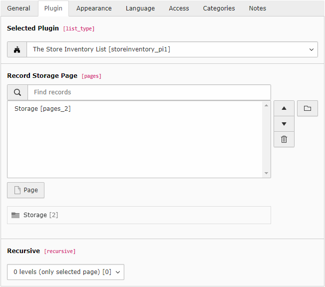
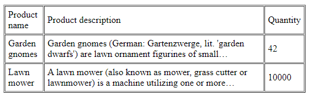

.. include:: /Includes.rst.txt
.. index::
   Frontend plugin;
   Plugin
.. _configuring-the-plugin:

======================
Configuring the plugin
======================

A plugin is a content element, that can be placed on a page
like any other element (like a text element or an image).
It is a "virtual" collection of one or more actions.
In our example there is only one controller action combination,
namely ``StoreInventory->list``.

.. index::
   Plugin; Configuration
   ExtensionUtility; configurePlugin()
   \TYPO3\CMS\Extbase; Utility\ExtensionUtility
   Files; ext_localconf.php

Configuring the plugin: :php:`ExtensionUtility::configurePlugin()`
==================================================================

To register a plugin, the following code must be inserted into the file
:file:`ext_localconf.php`, which resides in the top level of
the extension directory.

.. code-block:: php

   <?php
   // Prevent script from being called directly
   defined('TYPO3_MODE') or die();

   // encapsulate all locally defined variables
   (function () {
      \TYPO3\CMS\Extbase\Utility\ExtensionUtility::configurePlugin(
         'StoreInventory',
         'Pi1',
         [
            \T3docs\StoreInventory\Controller\StoreInventoryController::class => 'list',
         ],
         // non-cacheable actions
         [
            \T3docs\StoreInventory\Controller\StoreInventoryController::class => '',
         ]
      );
   })();

The first line prevents a calling of the PHP code in this file outside of the TYPO3_MODE context
This is a small security measure.
The static method :php:`\TYPO3\CMS\Extbase\Utility\ExtensionUtility::configurePlugin()`
is used to configure the plugin for use in TYPO3.
The first parameter denotes the extension key in UpperCamelCase (ExtensionKey).
With the second argument :php:`'Pi1'` (short for plugin no. 1), a unique name is given for the plugin (also in UpperCamelCase notation).
This is later used to identify the plugin clearly.
The third argument is an array with all allowed controller action combinations.
The array key is the fully-qualified controller class name
and the array value is a comma-separated list of all allowed actions.
In this case there is only the ``list`` action (also without the suffix ``Action``).
Thus the array :php:`[\Vendor\StoreInventory\Controller\StoreInventoryController::class -> 'list']`
registers the method :php:`listAction()`
in the :php:`\T3docs\StoreInventory\Controller\StoreInventoryController`.
All actions are cached by default. If an uncached action is required,
an additional controller/action combination must be added as the fourth parameter.
This array has the same format as the third parameter.
It must list all actions whose results should not be stored in the cache.

This concludes the configuration of the plugin.

.. index::
   Plugin; registration
   ExtensionUtility::registerPlugin()
   Files; Configuration/TCA/Overrides/tt_content.php

Plugin registration: :php:`ExtensionUtility::registerPlugin()`
==============================================================

The plugin must be registered to have it actually appear as a selectable element in the backend plugin list.
To achieve this, the following line must be inserted into the file :file:`Configuration/TCA/Overrides/tt_content.php`:

.. code-block:: php

    <?php

    \TYPO3\CMS\Extbase\Utility\ExtensionUtility::registerPlugin(
        'StoreInventory',
        'Pi1',
        'The Store Inventory List',
        'EXT:store_inventory/Resources/Public/Icons/Extension.svg'
    );

The first argument is like in the method :php:`configurePlugin()` again the
extension key, and the second is the name of the plugin :php:`Pi1`.
The third argument is the title of the plugin used in the select box of the content element.
After activating the extension (and clearing the cache), the plugin can be inserted on a page.
Don't forget to set the sys_folder, where the products are stored as the starting point
(in this case, "Inventory"). This can be done at the end of the plugin in the backend and globally in the page configuration TSConfig::

   TCEFORM.tt_content.pages.PAGE_TSCONFIG_ID = 2

Otherwise, your products are not found (see figure 4-4).

   Figure 4-4: Our plugin appears in the selection box of the content element.

The next call of the page with the plugin shows the inventory as a table (figure 4-5).

   Figure 4-5: The output of the inventory in the frontend

This marks the end of this little Extbase extension.
This example was intentionally simple to get you started.
It illustrates all the important steps and the conventions.
